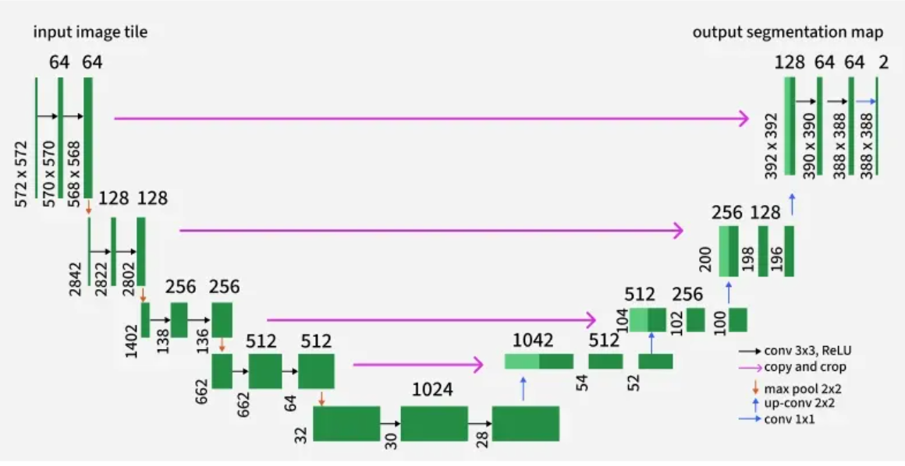
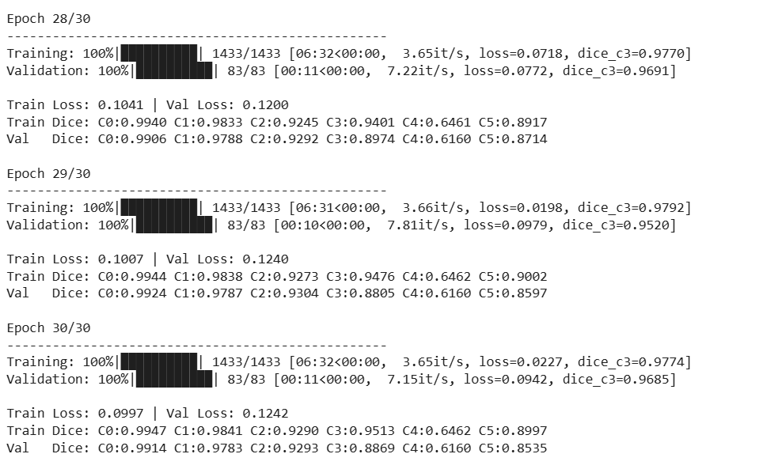
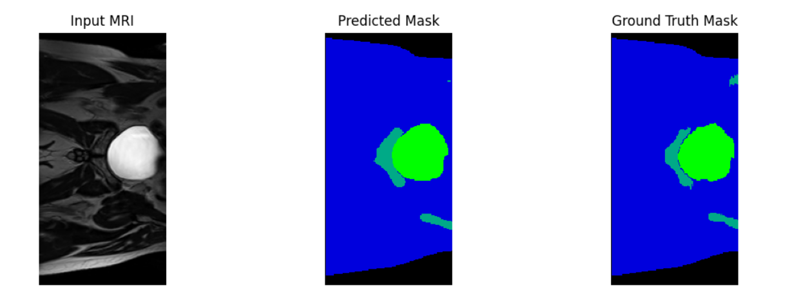

# 2D Improved U-Net
## Project Overview

This project implements an Improved 2D U-Net architecture for multi-class semantic segmentation of prostate MRI slices from the HipMRI Study dataset. The model was trained on over 11,000 MRI slices, each paired with its corresponding segmentation mask.

The improved design replaces standard U-Net pooling layers with learnable stride-2 convolutions, adds Batch Normalization and LeakyReLU activations for smoother optimization, and incorporates Dropout regularization in the bottleneck to reduce overfitting.

## Model Explain
### 2D U-Net
The 2D U-Net is a convolutional neural network architecture designed specifically for biomedical image segmentation.
It was first proposed by Ronneberger et al. (2015) for cell segmentation in microscopy images and has since become one of the most widely used models in medical imaging tasks.

The U-Net consists of two main components — an Encoder (downsampling) and a Decoder (upsampling) — connected by skip connections.
Skip connections link features from the encoder to the corresponding decoder layers, combining high-resolution spatial details with contextual, downsampled information. This fusion enables the network to produce accurate and detailed segmentation results.
example of a 2D UNet visulization:



### Imporevment
For this task, I implemented an Improved 2D U-Net while maintaining the core encoder–decoder structure of the original model.
Key modifications include:

1. LeakyReLU activations instead of ReLU to prevent the “dying ReLU” problem.

2. Batch Normalization for more stable and faster training.

3. Removed unnecessary bias terms since BatchNorm already provides an affine transformation.

4. Replaced MaxPooling with learnable stride-2 convolutions, allowing the network to learn how to downsample rather than using a fixed operation.

5. Added Dropout (p=0.2) in the bottleneck to reduce overfitting.

### ImImproved 2D U-Net Data Flow
**Encoder**: 
    Continue downsampling via stride-2 convolutions (learned compression)
    Channel capacity doubles per level (32 → 64 → 128 → 256 → 512)
    Each block: Conv → BN → LeakyReLU → Conv → BN → LeakyReLU

**Bottleneck**:
    Highest capacity (512 channels) with a DoubleConv
    Dropout2d (p=0.2) for regularization

**Decoder**:
    Continue upsampling via ConvTranspose2d
    Skip connections concatenate the matching encoder features at each scale
    Channel capacity halves per level (512 → 256 → 128 → 64 → 32)

**Output Layer**:
    1×1 convolution with 6 channels

## Data Set
### Dataset and Data Splits
The HipMRI dataset provides paired 2D MRI prostate slices and their segmentation masks in .nii.gz format, All images were standardized using Z-score normalization and resized to 256×128 pixels.
The dataset was divided into three parts: a training set (used to learn the model parameters), a validation set (used to monitor generalization during training), and a test set (used to evaluate the final trained model on unseen data).

## Training and Prediction
### Traning Results
The model was trained for 30 epochs with a batch size of 8, using Dice loss as the objective function.
Dice loss is derived from the Dice Similarity Coefficient (DSC) and measures the overlap between predicted and ground-truth segmentation masks.
During training, per-class Dice scores (C0–C5) were also computed to monitor segmentation performance across different tissue types.
Training used the AdamW optimizer with an initial learning rate of 1×10⁻⁴ and weight decay of 1×10⁻⁵ to improve generalization.
Validation was conducted after each epoch to track progress and prevent overfitting.
The model achieved a minimum class Dice score of 0.927 (the lowest of six classes at Epoch 28).
as figure show below:


### Prediction Outcome
After training, the model’s learned weights were saved in a checkpoint file (best_model.pth).
This file stores the network’s optimized parameters — representing what the model has learned from the training data.
The prediction function then loads this trained model and performs inference on unseen test images from the keras_slices_test dataset.
Each test slice is normalized, passed through the network, and produces a pixel-wise segmentation mask.
Below is an example test image showing the input MRI, predicted segmentation mask, and ground-truth mask:


## Dependencies
```
Python ≥ 3.8
PyTorch (torch)
tqdm
nibabel
matplotlib
numpy
```
This report is trained on google colab so in order to run code pleas:

In ***train.py***  remove if running in Colab and model is defined elsewhere:
```
from modules import Improved2DUNet, DiceLoss
from dataset import make_loaders
```
change input and out put file to relevent path:
```
data_path = "/content/drive/My Drive/keras_slices_data"
save_dir='/content/drive/My Drive/checkpoints'
```
In ***predict.py*** also # remove if running in Colab and model is defined elsewhere:
```
from dataset import _zscore
from modules import Improved2DUNet  # remove if running in Colab and model is defined elsewhere
```
also change input and out put file to relevent path:
```
CHECKPOINT_PATH = "/content/drive/My Drive/checkpoints/best_model.pth"
TEST_IMAGE = "/content/drive/My Drive/keras_slices_data/keras_slices_test/case_040_week_0_slice_0.nii.gz"
```